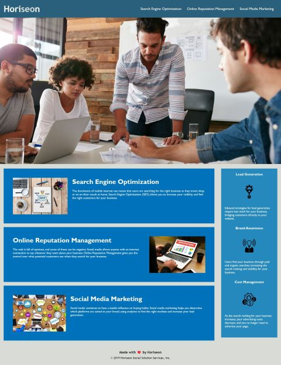

# Code Refactoring

## The Aim of the Exercise

The ultimate aim of this challenge was to refactor the HTML and CSS code of the Horiseon website to make it more human-friendly, rather than just technically correct. A good deal of the CSS code was consolidated, because identical styling had been used for different classes under different names. A large number of lines of unnecessary code in the CSS file were removed using this method.
The HTML code was refactored to make it more accessible to disabled people - mainly those using screenreaders. There were "title" and "alt" attributes added to the images on the index page, including the large main image, which was actually the background, rather than a regularly placed image file. Semantic tags were also added where possible, making the structure of the page more logical.

<https://bertiemoogle.github.io/bootcamp-challenge-one/>
